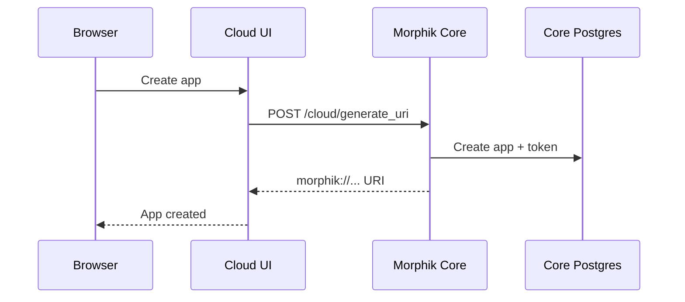
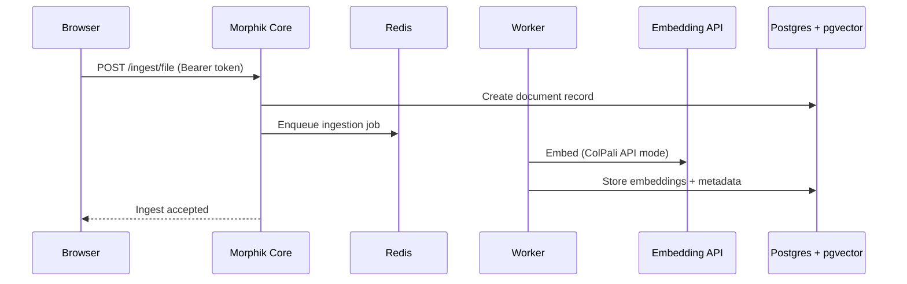
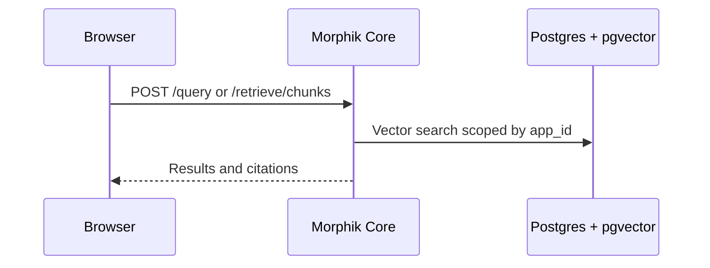

Morphik Cloud is split into two services that communicate over HTTPS:

- **Morphik Cloud UI**: The control plane that handles users, orgs, billing, and app provisioning.
- **Morphik Core**: The data plane that stores documents and embeddings, runs ingestion, and serves retrieval and chat.

This separation keeps your application management in the UI while all document data lives in the core API.

## Components at a glance

| Component | Primary role | Typical hosting |
| --- | --- | --- |
| Cloud UI | Auth, orgs, billing, app metadata, dashboards | Vercel (or your web host) |
| Morphik Core | Ingestion, storage, retrieval, search, chat | EC2 or Kubernetes |
| Embedding GPU (optional) | Multimodal embeddings (ColPali API mode) | Lambda GPU, on-prem GPU |
| Postgres + pgvector | Documents, embeddings, app isolation | Neon or any Postgres |
| Object storage | Raw files and chunk payloads | S3 or local disk |
| Redis + worker | Async ingestion pipeline | Same VPC as core |

## Morphik URI: the contract between UI and Core

When you create an app, Morphik Core returns a Morphik URI:

```
morphik://<app-name>:<jwt-token>@<host>
```

The Cloud UI parses this URI, extracts the token, and uses it for API calls:

```
Authorization: Bearer <jwt-token>
```

The token contains the `app_id`, and Morphik Core uses that to isolate data per app.

## Provisioning flow (control plane)

App creation is a control-plane operation that provisions an app and returns a Morphik URI.



In a dedicated-cluster setup, the UI can call the cluster directly (instead of the shared API) and pass an admin secret to mint the URI.

## Runtime flow (data plane)

Once an app exists, the UI talks to Morphik Core directly from the browser. Core verifies the token and scopes all reads and writes by `app_id`.

### Ingestion



If you run in local embedding mode, the worker generates embeddings on the core instance instead of calling the external GPU.

### Retrieval and chat



## Agent mode (server-side)

Agent mode runs in a server route (Cloud UI) so it can call your LLM provider securely. The agent uses Morphik Core as a tool:

- The UI calls `/api/agent/chat` on the Cloud UI.
- The server route calls Morphik Core for retrieval (using the app token).
- The server route streams the LLM response back to the browser.
